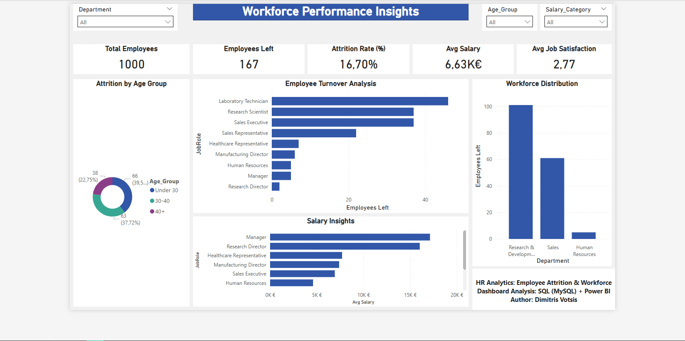
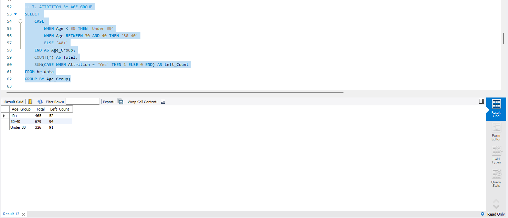

# 📊 HR Analytics: Employee Attrition & Workforce Analysis

## 📌 Project Overview
This project focuses on identifying the key drivers behind employee attrition using **SQL** for data transformation and **Power BI** for visual storytelling. By analyzing demographics, job roles, and satisfaction levels, I developed insights to help HR departments reduce turnover rates.

## 🎯 Objectives
*   Calculate core HR metrics (Attrition Rate, Headcount).
*   Segment the workforce into Age Groups to detect high-risk demographics.
*   Analyze the correlation between Job Satisfaction and Attrition.
*   Create a dynamic dashboard for real-time workforce monitoring.

## 🛠 Tools & Technologies
- **Database:** MySQL (Data Cleaning & View Creation)
- **Visualization:** Power BI Desktop
- **Analytics Techniques:** Case Logic, View Architecture, KPI Tracking

## 📉 Data Analysis (SQL Architecture)

### 1. Age Group Segmentation
I used `CASE` statements to group employees and identify which age bracket is most prone to leaving:
```sql
SELECT 
    CASE 
        WHEN Age < 30 THEN 'Under 30'
        WHEN Age BETWEEN 30 AND 40 THEN '30-40'
        ELSE '40+'
    END AS Age_Group,
    COUNT(*) AS Total,
    SUM(CASE WHEN Attrition = 'Yes' THEN 1 ELSE 0 END) AS Attrition_Count
FROM hr_data
GROUP BY Age_Group;
```

2. View Creation for BI Connection
To ensure data integrity and performance in Power BI, I developed a centralized SQL View:

```sql
CREATE OR REPLACE VIEW View_HR_Analysis AS
SELECT EmployeeNumber, Age, Department, JobRole, Attrition,
CASE WHEN Age < 30 THEN 'Under 30' ELSE '30+' END AS Age_Group
FROM hr_data;
```

## 📈 Interactive HR Dashboard

## 📊 SQL Analytics Preview

## 🚀 Key Insights
- **Age Factor:** Employees under 30 show a significantly higher attrition rate (as seen in the Age Group segmentation).
- **Departmental Trends:** Sales and R&D departments require targeted retention strategies.
- **Satisfaction Levels:** Low environment and job satisfaction are primary indicators of potential resignation.

## 📁 Project Structure
* **01_Data/**: Raw and processed HR datasets.
* **02_SQL/**: SQL scripts for data exploration and View creation.
* **03_PowerBI/**: Power BI report documentation (PDF).
* **04_Screenshots/**: SQL results and Dashboard visuals.
* **05_README/**: Technical project documentation.
